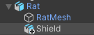

In Unity, a parent GameObject can have **child GameObjects** that move, rotate, and scale with it. This is really useful for positioning the child objects in relation to their parent. A parent can have many child GameObjects, but a child can have only one parent:

Models can be added to a scene as child GameObjects by dragging them from the Project window and placing them underneath the parent GameObject in the Hierarchy window. The child GameObject will be indented in the Hierarchy window structure:

You can also right-click on the parent GameObject and create a new GameObject from a 3D shape. The new 3D shape GameObject will automatically be added as a child GameObject:

