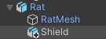
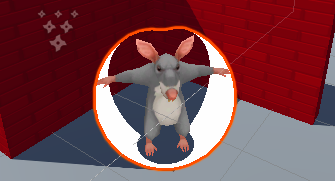
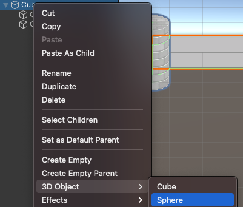

Dans Unity, un GameObject parent peut avoir des **GameObjects enfants** qui se déplacent, tournent et changent d'échelle avec lui. C'est vraiment utile pour positionner les enfants par rapport à leur parent. Un parent peut avoir plusieurs GameObjects enfants mais un enfant ne peut avoir qu'un seul parent :

Les modèles peuvent être ajoutés à une scène en tant que GameObjects enfants en les faisant glisser depuis la fenêtre Project et en les plaçant sous le GameObject parent dans la fenêtre Hierarchy. Le GameObject enfant sera indenté dans la structure de la fenêtre Hierarchy :

Tu peux aussi faire un clic droit sur le GameObject parent et créer un nouveau GameObject à partir d'une forme 3D. Le nouveau GameObject de forme 3D sera automatiquement ajouté en tant que GameObject enfant :

