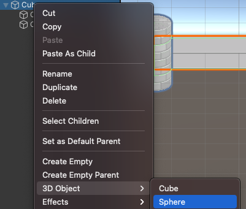

In Unity kan een bovenliggend GameObject **onderliggende GameObjects** hebben die meebewegen, roteren en schalen. Dit is echt handig voor het positioneren van de onderliggende (child) objecten ten opzichte van hun bovenliggende (parent) objecten. Een bovenliggend object kan veel onderliggende GameObjects hebben, maar een onderliggend object kan slechts één bovenliggend object hebben:

Modellen kunnen als onderliggend GameObjects aan een scène worden toegevoegd door ze vanuit het venster Project te slepen en ze onder het bovenliggende GameObject in het Hierarchy venster te plaatsen. Het onderliggende GameObject wordt ingesprongen in de structuur van het Hierarchy venster:

Je kunt ook met de rechtermuisknop op het bovenliggende GameObject klikken en een nieuw GameObject maken vanuit een 3D-vorm. Het nieuwe 3D GameObject wordt automatisch toegevoegd als een onderliggend GameObject:

